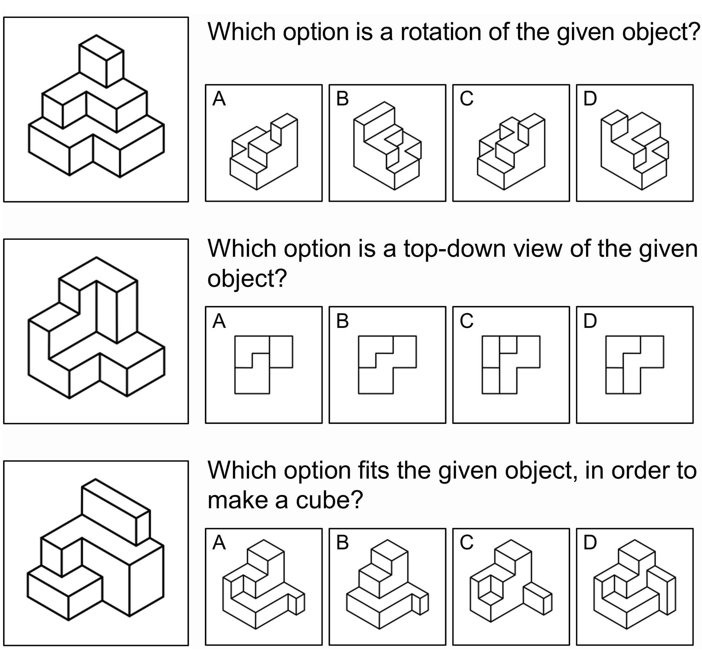

<div align="center">

# PureSpace: A Benchmark for Abstract Spatial Reasoning in Vision-Language Models

[[Data](https://huggingface.co/datasets/canglanx/purespace)] &emsp; [[Paper](https://openaccess.thecvf.com/content/CVPR2026F/papers/Li_PureSpace_A_Benchmark_for_Abstract_Spatial_Reasoning_in_Vision-Language_Models_CVPRF_2026_paper.pdf)] &emsp; [[Supp](https://openaccess.thecvf.com/content/CVPR2026F/supplemental/Li_PureSpace_A_Benchmark_CVPRF_2026_supplemental.pdf)]

</div>

<p align="center">
  
</p>

## How to Generate Your Own Data

**1. Clone repository**
```bash
git clone https://github.com/canglanx/purespace.git
cd purespace
```

**2. Setup environment**
```bash
uv sync
```

**3. Configure output directory**
```bash
nano ./configs/data_generation/demo.yaml
```

**4. Run quick demo**
```bash
uv run python -m purespace.data_generation.cli --config ./configs/data_generation/demo.yaml
```

**5. (Alternatively) Run large-scale generation with debug mode**
```bash
uv run python -m purespace.data_generation.cli --config ./configs/data_generation/large.yaml --debug
```

## Citation
```
@inproceedings{li2026purespace,
    title     = {PureSpace: A Benchmark for Abstract Spatial Reasoning in Vision-Language Models},
    author    = {Li, Jinkai and Zhang, Zhenliang and Fan, Lifeng and Wang, Wei},
    booktitle = {Proceedings of the IEEE/CVF Conference on Computer Vision and Pattern Recognition (CVPR) Findings},
    year      = {2026},
}
```
